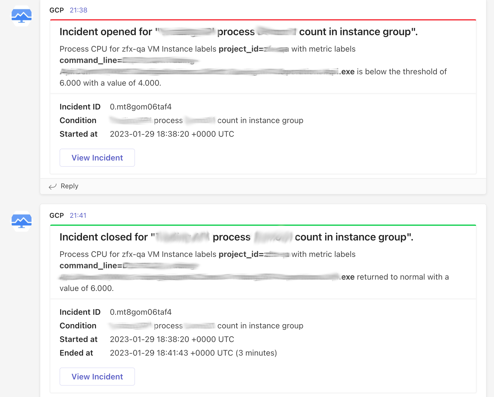
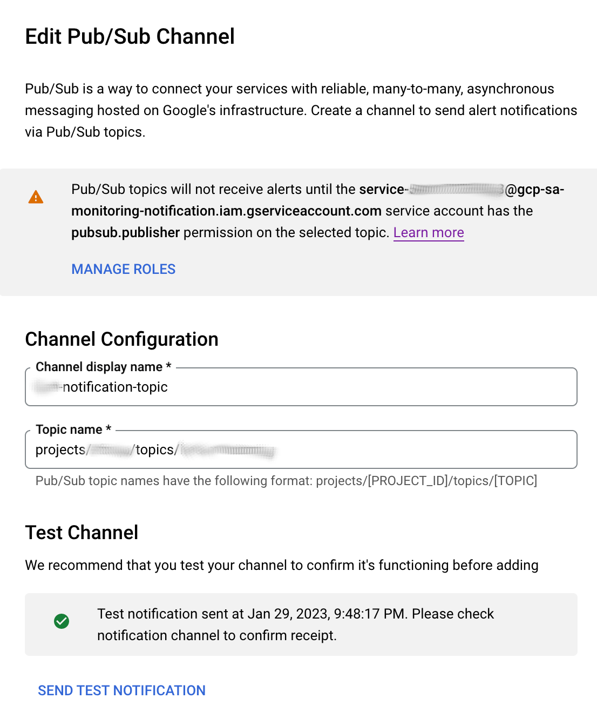
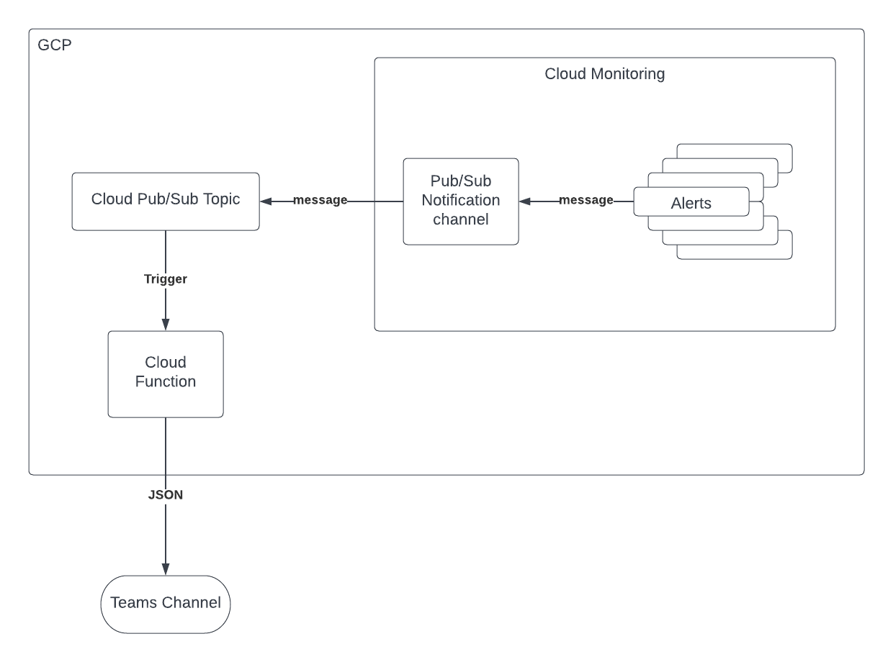

# gcp-monitoring-to-teams-from-subpub-topic

⚙️ A simple Google Cloud Function in Go to transform / proxy [Google Cloud Platform (GCP) Monitoring](https://cloud.google.com/monitoring) notifications to [Microsoft Teams](https://teams.microsoft.com/) from GCP Pub/Sub topic.

_Forked from https://github.com/Courtsite/gcp-monitoring-to-teams

## Getting Started

### Prerequisites

- Ensure you have `gcloud` installed:
    - MacOS: `brew cask install google-cloud-sdk`
    - Others: https://cloud.google.com/sdk/gcloud
- Ensure you have authenticated with Google Cloud: `gcloud init`
- Set your current working project: `gcloud config set project <project>`

1. Clone / download a copy of this repository
2. Copy `env.sample.yaml` to `env.yaml`, and modify the environment variables declared in the file
3. Create pubsub topic `gcloud pubsub topics create --help` or through the ui https://console.cloud.google.com/cloudpubsub/topic
4. Copy `./deploy.sample.sh` to `deploy.sh` and and modify, set gcp-region name, created topic name
5. Configure GCP Monitoring pubsub notification channel `gcloud alpha monitoring channels create --help` or or through the ui https://console.cloud.google.com/monitoring/alerting/notifications
6. Grant `role/pubsub.publisher` to `service-numbers@gcp-sa-monitoring-notification.iam.gserviceaccount.com`

### Interaction

